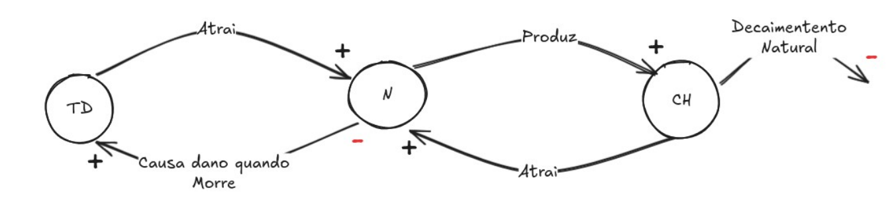
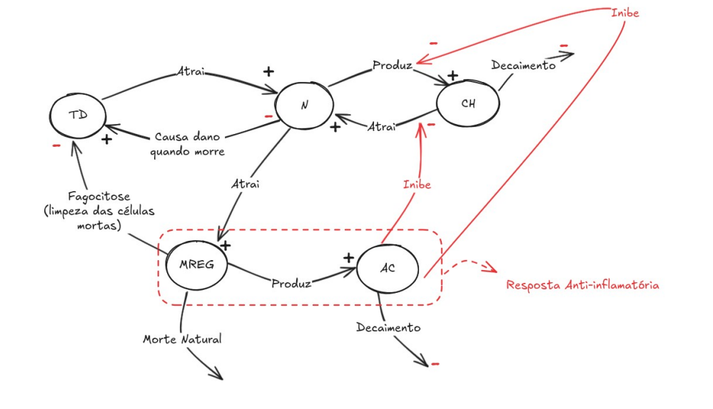

### Computational Modeling

### Ordinary Differential Equations (ODE) for Modeling the Imune System on Inflamatory Response
This repository presents a computational model using Ordinary Differential Equations (ODEs) to simulate the behavior of tissue damage and immune response during an inflammatory process, such as a skin wound. The model was developed as part of an academic project for the Computational Modeling course.

#### Model without Immunologic Response
This model captures the basic dynamics of tissue damage, neutrophils, and pro-inflammatory cytokines without regulatory immune intervention.

We can derive Equations as follows: 

$$\frac{d}{dt}TD(t) = \alpha N(t)$$
$$\frac{d}{dt} N(t)= \beta TD(t) + \gamma CH(t) -\alpha N(t)$$
$$\frac{d}{dt} CH(t) = \rho N(t) - \sigma CH(t)$$

#### Model with Immunologic Response

This extended model introduces the immune regulation through macrophages $M(t) $and anti-inflammatory cytokines $A(t)$. 

Figure includes the immunologic response on the previous model. 

$$\frac{d}{dt}TD(t) = \alpha N(t) - u_{reg} M(t)$$
$$\frac{d}{dt}N(t) = \beta TD(t) + \frac{\gamma CH(t)}{(1+\mu_{A}A(t))} -\alpha N(t)$$
$$\frac{d}{dt}CH(t) = \frac{\rho N(t)}{(1+\alpha_A A(t))} -\eta_{CH} CH(t)$$
$$\frac{d}{dt}M(t) = v N(t) -\eta_M M(t)$$
$$\frac{d}{dt}A(t) = w_{reg} M(t) -\eta_A A(t)$$

The results show that all variables grow indefinitely. Particularly, the tissue damage $TD(t), pro-inflammatory cytokines $CH(t)$ and neutrophils $N(t)$ follow an uncontrolled exponential pattern. This suggests that without anti-inflammatory action, the inflammatory process becomes self-reinforcing and unbounded.
*Conclusion:* The wound never heals without immune response. 

